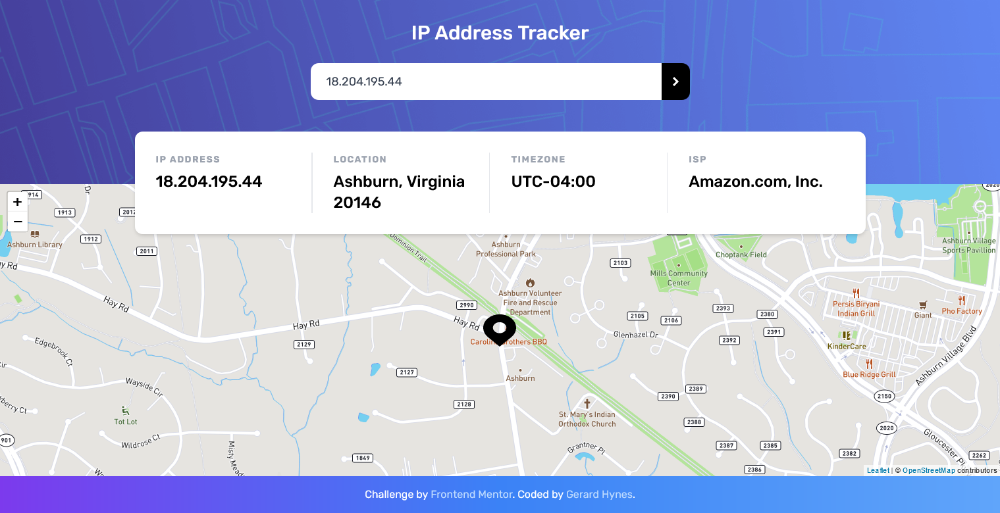

# Frontend Mentor - IP address tracker

An IP information app built to solve a [Frontend Mentor](https://www.frontendmentor.io) challenge.

[View the app](https://goofy-spence-1d3ac9.netlify.app/)

Built with:

- React
- Tailwind CSS
- IP Geolocation API by IPify
- React Leaflet
- Mapbox
- Netlify Functions

I ran into some issues with CORS while building this project and wrote a post about [how I solved it using a serverless function](https://gerardhynes.com/how-to-overcome-cors-with-serverless-functions/).
